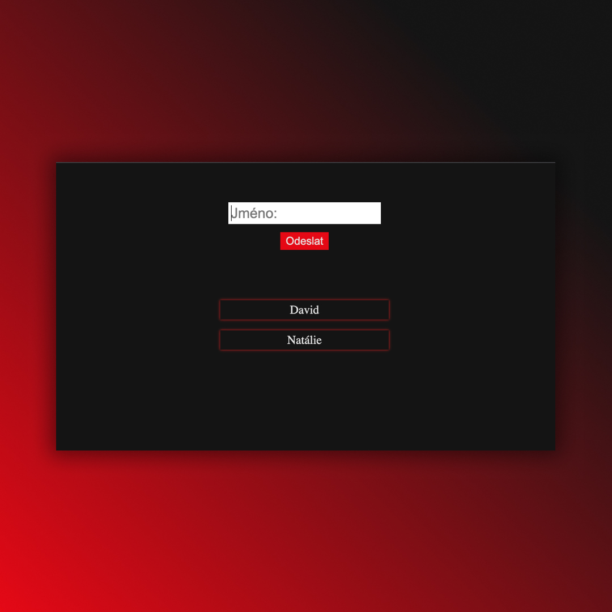

## First form in React
• Work with form 📝
• Practicing useState, Spread operator, Rest operator ✅

## Screenshots 📱

## 💻 Tech Stack

## 🌐 Link
<a href="https://first-form-dejvcodes.netlify.app/">First form in React</a>

## License🔐
[MIT License](LICENSE)